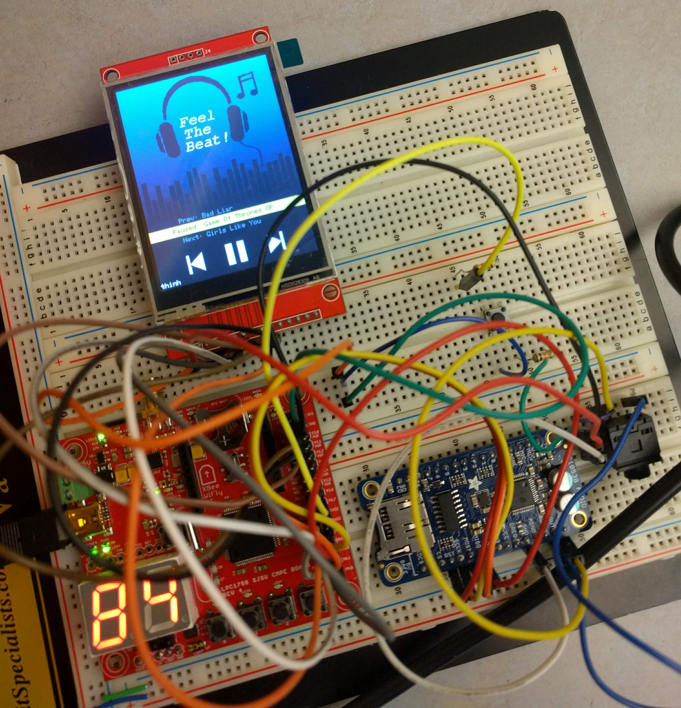

## CMPE-146 FINAL PROJECT: A TOUCHSCREEN MP3 PLAYER
Building a portable MP3-Player with basic playing modes and volumn controls. This FreeRTOS program runs on SJ-One Board (LPC1958) and uses SPI to communicate with audio decoder (VS1053), touchscreen LCD (ILI9341 & XPT2046), and to read MP3 files from SD Card. I completed this project in 2019 as the final project for CMPE-146. More details will be added soon.

### DEMO VIDEO

  

  